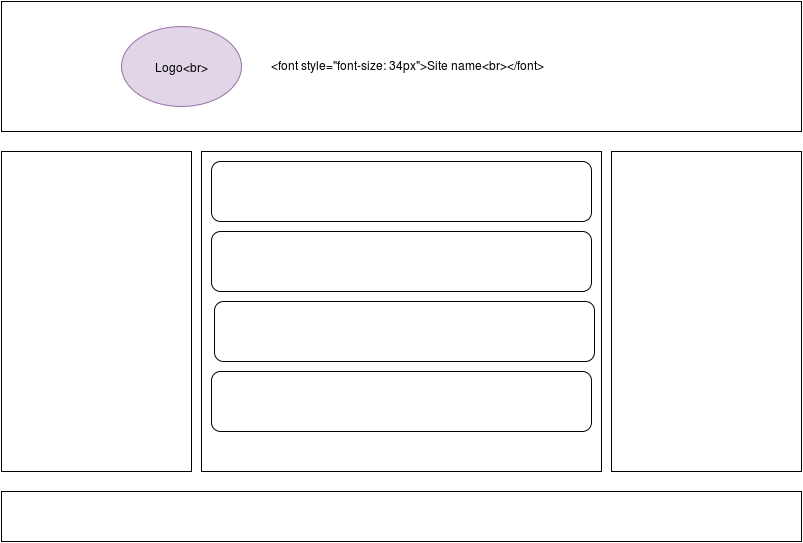

# Лабораторна робота #1

## Завдання

Створити веб сторінку згідно шаблону.

Не дозволяється використовувати сторонні бібліотеки. Сайт повинен мати адаптивний дизайн. Підтримувати мінімум екрани телефону, планшета та персонального комп’ютера.

## *Примітка

Для вашого README.md викоистайте [README-Example.md](README-Example.md) 
